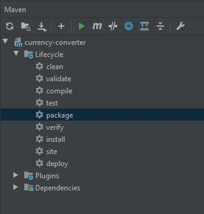

# Running in Docker
* Make sure that you have installed [Docker](https://docs.docker.com/engine/installation/).
* Clone this repository.
* Open the application in any IDE and launch package in maven lifecycle to create war file.



* Or in the application root folder run command(if maven is installed).

```
 mvn package
```

* When war file is ready, in the root folder run:
	
```
 docker-compose up
```
* The app should be accessible from [http:localhost:8080](http:localhost:8080).
